# Домашнее задание №7 (Тема "Блокировки")

Описание/Пошаговая инструкция выполнения домашнего задания:

* Настройте сервер так, чтобы в журнал сообщений сбрасывалась информация о блокировках, удерживаемых более 200 миллисекунд. Воспроизведите ситуацию, при которой в журнале появятся такие сообщения.
  
 __*Необходимо включить параметр log_lock_waits. В этом случае в журнал сообщений сервера будет попадать информация, если транзакция ждала дольше, чем deadlock_timeout.*__
 __*Параметр "log_lock_waits" определяет, будут ли создаваться сообщения журнала, когда сеанс ожидает блокировки дольше deadlock_timeout. Это полезно для определения того, не приводит ли ожидание блокировки к снижению производительности. Параметр по умолчанию отключен.*__
 __*Параметр "deadlock_timeout" - это время, в течение которого необходимо ожидать блокировки, прежде чем проверить, есть ли условие взаимоблокировки.*__
 
> 
 __*Устанавливаю требуемые значения по заданию. После этого применяю изменения, перезагрузив конфигурационные файлы.*__
> 
 __*Для того, чтобы воспроизвести ситуацию, при которой в журнале появятся сообщения о блокировках, удерживаемых более 200 миллисекунд,
cоздаю базу данных test, таблицу tbl с тестовыми данными.*__
> 
 __*Начинаю первую сессию (pid = 16876). Обновляю первую строчку таблицы tbl, это режим Row Exclusive. Транзакцию после этого не завершаю.*__ 
> 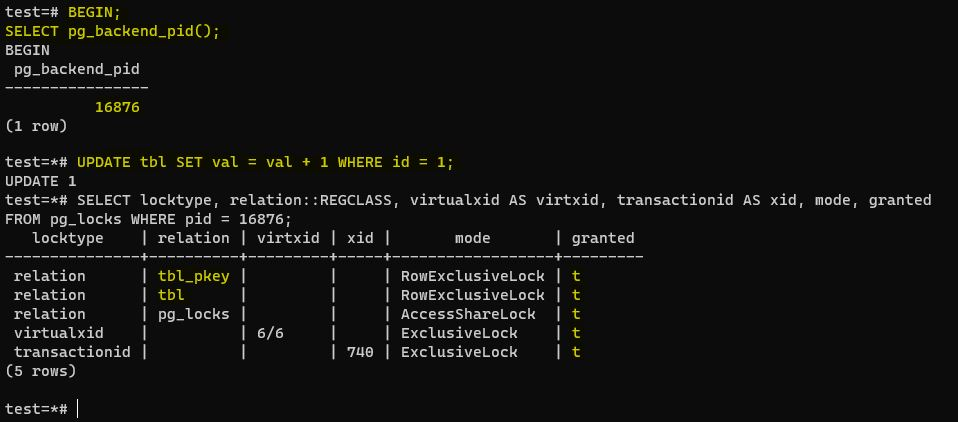
 __*Начинаю вторую сессию (pid = 17049). Пытаюсь создать индекс для таблицы tbl, это режим Share. Этот процесс "подвисает", так как Режимы Share и Row Exclusive вызывают блокировку отношений.*__ 
> 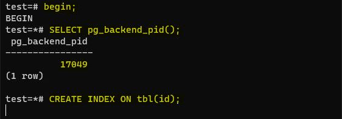
 __*Получили блокировку : pid = 16876  блокирует pid = 17049. Теперь смотрим информацию  ней в журнале сообщений.*__
> 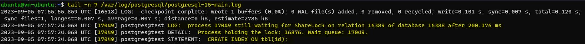	
* Смоделируйте ситуацию обновления одной и той же строки тремя командами UPDATE в разных сеансах. Изучите возникшие блокировки в представлении pg_locks и убедитесь, что все они понятны. Пришлите список блокировок и объясните, что значит каждая.

 __*Начал первую транзакцию (pid 17501).  Обновляю первую сточку таблицы tbl, команда выполнилась успешно. Транзакцию не завершаю.*__ 
> 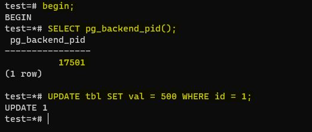
 __*Начал вторую транзакцию (pid 17508). Тоже обновляю первую сточку таблицы tbl, команда "подвисла". Транзакцию не завершаю.*__
> 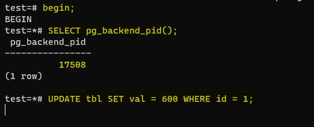
 __*Начал третью транзакцию (pid 17324). Тоже обновляю первую сточку таблицы tbl, команда "подвисла". Транзакцию не завершаю.*__
> 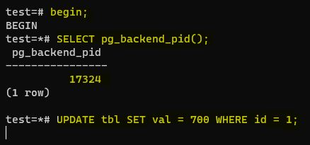
 __*В представлении pg_locks получил следующие блокировки.*__
> 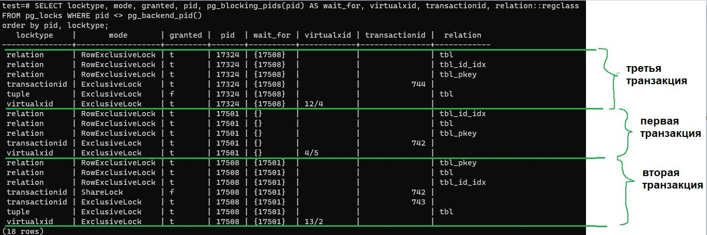

 __*Когда транзакция собирается изменить строку, она выполняет следующую последовательность действий:*__
 __*- Захватывает исключительную блокировку изменяемой версии строки (tuple).*__
 __*- Если xmax и информационные биты говорят о том, что строка заблокирована, то запрашивает блокировку номера транзакции xmax.*__
 __*- Прописывает свой xmax и необходимые информационные биты.*__
 __*- Освобождает блокировку версии строки.*__

 __*Блокировки номера транзакции (transactionid или virtualxid) – каждая транзакция самостоятельно удерживает исключительную блокировку (ExclusiveLock) своего собственного идентификатора, поэтому такие блокировки удобно использовать, когда нужно дождаться окончания другой транзакции. На нашем примере, когда транзакции начались, им были присвоены виртуальные идентификаторы virtualxid => 4/5, 13/2, 12/4.*__

 __*При выполнении первой транзакции (pid 17501) удерживаются блокировки таблицы (relation, granted=t) и собственного номера (transactionid, granted=t).*__ 
 __*При выполнении второй транзакции (pid 17508) помимо блокировки таблицы (relation, granted=t) и собственного номера (transactionid, granted=t ), мы видим еще две блокировки. Вторая транзакция обнаружила, что строка заблокирована (tuple) первой транзакцией и «повисла» на ожидании ее номера (transactionid , granted = f).*__
 __*При выполнении третьей транзакции (pid 17324) происходит попытка установить исключительную блокировку изменяемой версии строки (tuple) и "повисает" на этом шаге. Ситуация в третьей транзакци изменится тогда, когда завершится первая транзакция, третья транзакция, подобно второй, получит блокировку на обновляемую строку, и будет ждать завершения второй транзакции.*__
 __*Четвертая, пятая и т. д. транзакции, желающие обновить ту же самую строку, ничем не будут отличаться от третей транзакции  — все они будут «висеть» на одной и той же блокировке версии строки.*__ 
> 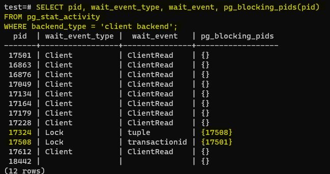

* Воспроизведите взаимоблокировку трех транзакций. Можно ли разобраться в ситуации постфактум, изучая журнал сообщений?
  
 __*Выполнил последовательность команд в следующем порядке:*__
 __*(1 шаг) транзакция 1 - UPDATE tbl SET val = 1 WHERE id = 1;*__
 __*(2 шаг) транзакция 2 - UPDATE tbl SET val = 2 WHERE id = 2;*__
 __*(3 шаг) транзакция 3 - UPDATE tbl SET val = 3 WHERE id = 3;*__
 __*(4 шаг) транзакция 1 - UPDATE tbl SET val = 11 WHERE id = 2;*__
 __*(5 шаг) транзакция 2 - UPDATE tbl SET val = 22 WHERE id = 3;*__
 __*(6 шаг) транзакция 3 - UPDATE tbl SET val = 31 WHERE id = 1;*__

 __*Окно консоли первой транзакции:*__
> 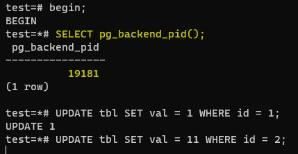
 __*Окно консоли второй транзакции:*__
> 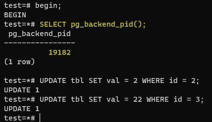
 __*Окно консоли третьей транзакции:*__
> 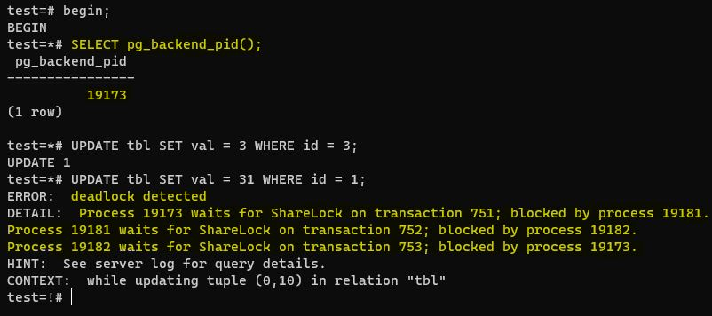

 __*После того, как возник deadlock посмотрел журнал сообщений.*__
 __*В 12:19:50.911 зафиксирована взаимоблокировка и вся связанная с ней информация. Видны pid всех трех транзакций (19181, 19182, 19173). Получается, что да, изучая журнал сообщений разобраться в ситуации постфактум возможно.*__
> 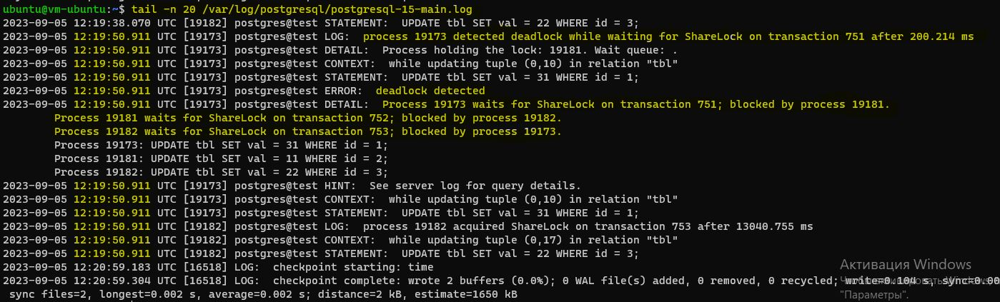

* Могут ли две транзакции, выполняющие единственную команду UPDATE одной и той же таблицы (без where), заблокировать друг друга?
 __*Да, такое возможно. Если первая транзакция будет обновлять строки таблицы в прямом порядке, а вторая транзакция - в обратном порядке.*__ 

