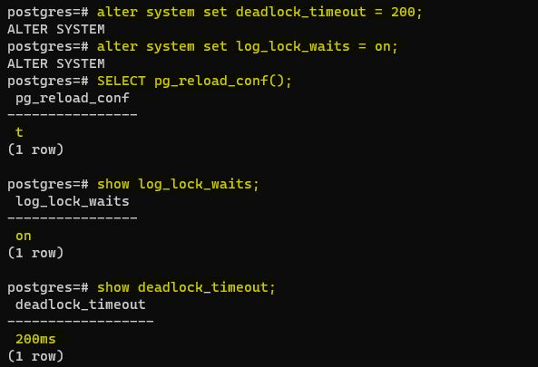

# Домашнее задание №7 (Тема "Блокировки")

Описание/Пошаговая инструкция выполнения домашнего задания:

* Настройте сервер так, чтобы в журнал сообщений сбрасывалась информация о блокировках, удерживаемых более 200 миллисекунд. Воспроизведите ситуацию, при которой в журнале появятся такие сообщения.
  
 __*Необходимо включить параметр log_lock_waits. В этом случае в журнал сообщений сервера будет попадать информация, если транзакция ждала дольше, чем deadlock_timeout (несмотря на то, что используется параметр для взаимоблокировок, речь идет об обычных ожиданиях).*__
 __*Параметр log_lock_waits Определяет, будет ли создаваться сообщение журнала, когда сеанс ожидает блокировки дольше deadlock_timeout. Это полезно для определения того, не приводит ли ожидание блокировки к снижению производительности. Значение по умолчанию —off.*__
 __*Параметр  deadlock_timeout - Это время, в течение которого необходимо ожидать блокировки, прежде чем проверить, есть ли условие взаимоблокировки.*__
	> 
 __*Устанавливаю требуемые значения по заданию,  применяю изменения перезагрузив конфигурационные файлы.*__
	> 
 __*Для того, чтобы воспроизвести ситуацию, при которой в журнале появятся сообщения о блокировках, удерживаемых более 200 миллисекунд
cоздаю базу данных test, таблицу tbl с тестовыми данными.*__
	> 
create database test;
\c test – подключиться к БД test
CREATE TABLE tbl (  id integer PRIMARY KEY,   val numeric);
INSERT INTO tbl VALUES (1,100), (2,200), (3,300);

Начинаю первую сессию (pid = 16876). Рис_1_3
BEGIN;
SELECT pg_backend_pid(); --смотрим ID транзакции
UPDATE tbl SET val = val + 1 WHERE id = 1;

Начинаю вторую сессию (pid = 17049) Рис_1_4
BEGIN;
SELECT pg_backend_pid(); --смотрим ID транзакции
CREATE INDEX ON tbl(id);
Получили блокировку : pid = 16876  блокирует pid = 17049. Рис 1_7. Теперь смотрим информацию  ней в журнале сообщений. Рис_1_5.
	SELECT pg_blocking_pids(17049);

select * from pg_locks limit 5;

* 2.	Смоделируйте ситуацию обновления одной и той же строки тремя командами UPDATE в разных сеансах. Изучите возникшие блокировки в представлении pg_locks и убедитесь, что все они понятны. Пришлите список блокировок и объясните, что значит каждая.

Начал первую транзакцию. Рис_2_1. 
UPDATE tbl SET val = 500 WHERE id = 1; 
Начал вторую транзакцию. Рис_2_2. 
UPDATE tbl SET val = 600 WHERE id = 1;
Начал третью транзакцию. Рис_2_3. 
UPDATE tbl SET val = 700 WHERE id = 1;

Когда транзакция собирается изменить строку, она выполняет следующую последовательность действий:

1.	Захватывает исключительную блокировку изменяемой версии строки (tuple).
2.	Если xmax и информационные биты говорят о том, что строка заблокирована, то запрашивает блокировку номера транзакции xmax.
3.	Прописывает свой xmax и необходимые информационные биты.
4.	Освобождает блокировку версии строки.

В представлении pg_locks получил следующие блокировки. Рис_2_4.

SELECT locktype, mode, granted, pid, pg_blocking_pids(pid) AS wait_for, virtualxid, transactionid, relation::regclass 
FROM pg_locks WHERE pid <> pg_backend_pid() 
order by pid, locktype;

  

Блокировки уровня объектов (relations), то есть таблицы, индексы, последовательности, материализованные представления…. Эти блокировки обычно защищают объекты от одновременного изменения или от использования в то время, когда объект изменяется. Мы выполнили в сессиях команду UPDATE одной и той же таблицы test, по этому создались блокировки уровня  relations  вида RowExclusiveLock.

Блокировки номера транзакции (transactionid или virtualxid) – каждая транзакция самостоятельно удерживает исключительную блокировку (ExclusiveLock) своего собственного идентификатора, поэтому такие блокировки удобно использовать, когда нужно дождаться окончания другой транзакции. На нашем примере, когда транзакции начались, им были присвоены виртуальные идентификаторы virtualxid => 4/5, 13/2, 12/4.

При выполнении первой транзакции (pid 17501)  удерживаются блокировки таблицы (relation, granted=t) и собственного номера (transactionid, granted=t ). При выполнении второй транзакции (pid 17508)  помимо блокировки таблицы (relation, granted=t) и собственного номера (transactionid, granted=t ), мы видим еще две блокировки. Вторая транзакция обнаружила, что строка заблокирована (tuple) первой транзакцией и «повисла» на ожидании ее номера (transactionid , granted = f).  
При выполнении третьей транзакции (pid 17324) происходит попытка установить исключительную блокировку изменяемой версии строки (tuple) и повисает на этом шаге. Ситуация в третьей транзакци изменится тогда, когда завершится первая транзакция, третья транзакция, подобно второй, получит блокировку на обновляемую строку, и будет ждать завершения второй транзакции.
Четвертая, пятая и т. д. транзакции, желающие обновить ту же самую строку, ничем не будут отличаться от транзакции 3 — все они будут «висеть» на одной и той же блокировке версии строки. 

SELECT pid, wait_event_type, wait_event, pg_blocking_pids(pid)
FROM pg_stat_activity
WHERE backend_type = 'client backend';

* 3.	Воспроизведите взаимоблокировку трех транзакций. Можно ли разобраться в ситуации постфактум, изучая журнал сообщений?
Выполнил последовательность команд в следующем порядке:
транзакция 1 - UPDATE tbl SET val = 1 WHERE id = 1;
транзакция 2 - UPDATE tbl SET val = 2 WHERE id = 2;
транзакция 3 - UPDATE tbl SET val = 3 WHERE id = 3;
транзакция 1 - UPDATE tbl SET val = 11 WHERE id = 2;
транзакция 2 - UPDATE tbl SET val = 22 WHERE id = 3;
транзакция 3 - UPDATE tbl SET val = 31 WHERE id = 1;

UPDATE tbl SET val = 500 WHERE id = 1; 
SELECT pg_backend_pid();
После того, как возник deadlock посмотрел журнал сообщений. В 12:19:50.911 зафиксирована взаимоблокировка и вся связанная с ней информация. 
Видны pid всех трех транзакций (19181, 19182, 19173). 

* Могут ли две транзакции, выполняющие единственную команду UPDATE одной и той же таблицы (без where), заблокировать друг друга?
 __*Да, такое возможно. Если первая транзакция будет обновлять строки таблицы в прямом порядке, а вторая транзакция - в обратном порядке.*__ 
 __*Предположу, что есть еще способы, это один их них.*__
